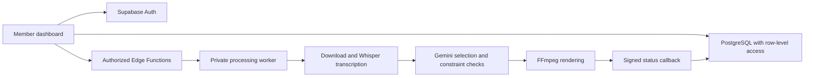

# ClipFarm

**An authenticated workspace for turning long-form video into campaign-ready clips.**

[](https://github.com/akram0i/clip-farm/actions/workflows/validate.yml)

ClipFarm combines a multi-user dashboard, a PostgreSQL data model, and a staged video-processing worker. Members submit campaign requirements and follow their own runs. Administrators review earnings evidence and track commissions. The pipeline downloads source video, transcribes speech locally, selects candidate moments, validates campaign constraints, and renders vertical clips with captions.

**Stack:** JavaScript · TypeScript · Python · Vite · Supabase · PostgreSQL · Whisper · Gemini · FFmpeg · GitHub Actions

### Start here

- [Architecture and authorization](architecture/SUPABASE_BACKEND.md): data ownership, row-level policies, and server-side operations.
- [Engineering walkthrough](architecture/ENGINEERING.md): design decisions, verification, and known limitations.
- [Source completeness](architecture/SOURCE_STATUS.md): what is reproducible here and what still needs recovery.
- [Security and privacy](SECURITY.md): secret handling and the boundary between a public portfolio and a private worker.
- [Setup](#one-time-setup): configure your own services without committing credentials.

This repository is a source-code portfolio. It does not include production accounts, sample passwords, private earnings screenshots, or access to the deployed team's workspace. Features below describe the code in this repository; they are not a claim that every external service is currently configured or that every source-video provider is supported.

**Source status:** the core application is checked in, but this is not yet a complete copy of the latest hosted dashboard. Invite registration, admin account removal, the full admin screenshot-rule exemption, and the review-status follow-up are not integrated here. See the [recovery checklist](architecture/SOURCE_STATUS.md) before deploying or evaluating those features.



The repository separates the application into:

```text
clipfarm/
├── dashboard/                 # Vite member/admin application
├── supabase/
│   ├── migrations/            # tables, functions, RLS, storage policies
│   └── functions/             # start, callback, protected result download
├── pipeline/                  # yt-dlp → Whisper → Gemini → FFmpeg
├── .github/workflows/         # processing, validation, Pages fallback
├── contracts/                 # versioned dispatch/status/result contracts
├── architecture/              # backend and security explanation
├── scripts/validate_structure.py
└── tests/
```

## What is implemented

- Supabase email/password authentication; the application is inaccessible anonymously.
- Per-user campaign rows and histories stored in PostgreSQL, not inferred from GitHub.
- RLS ownership policies for campaigns, events, outputs, earnings, commissions, and private files.
- A server-authorized admin view with per-user total, pending, complete, and failed counts.
- A private earnings-screenshot queue with member/timestamp attribution and signed image access.
- A rolling 168-hour earnings cycle beginning at signup.
- Dismissible, server-capped reminders during days 1–6.
- Full member-data lockout at the deadline, with screenshot upload left available.
- Immediate same-session unlock on successful upload; admin review is intentionally asynchronous.
- Admin-entered confirmed earnings, snapshotted commission rates, owed totals, and append-only payments.
- Central server-side GitHub dispatch and result-download functions. No member sees or supplies GitHub settings.
- A staged video pipeline and signed status callbacks; execution requires configured services and accessible source media.
- Deterministic checks for clip duration, required hashtags/messaging, source bounds, and caption provenance.

See [the Supabase architecture](architecture/SUPABASE_BACKEND.md) for the security and data model.

## Intentional boundaries and tradeoffs

- Posting to TikTok, Instagram, YouTube, and submission to Whop remain manual.
- ClipFarm does not browse or scrape Whop and does not automate social-platform logins.
- Screenshot review is a trust-and-friction mechanism, not fraud-proof verification; images can be edited.
- GitHub Actions remains the compute worker. Running Whisper and FFmpeg inside Vercel or Supabase Functions would be unreliable and exceed normal serverless limits.
- The direct Supabase + Vercel implementation replaces the brief's Lovable-specific wrapper while preserving the requested Supabase Auth/database behavior. It keeps the code deployable and auditable in this repository.
- The `$0` goal is practical for a small team, not an unlimited guarantee. GitHub artifact storage, Supabase database/storage/egress, Vercel bandwidth, and Gemini quotas all have free-tier limits.
- Natural-language brand-policy enforcement still relies partly on Gemini judgment. Human review before posting remains necessary.

## One-time setup

### 1. Configure a processing repository

Keep this public repository for source review. Use a **private repository** for real team processing: Actions logs, summaries, and artifacts can contain campaign requirements, source URLs, transcript excerpts, and participant information. The processing workflow is restricted to private repositories. Free-tier compute is a separate constraint; do not trade away private data to obtain public-runner minutes.

Copy the code to that private repository, including `.github/workflows/`, and point the backend's `GITHUB_OWNER` and `GITHUB_REPO` settings at it.

Add these repository secrets under **Settings → Secrets and variables → Actions**:

| Secret | Purpose |
|---|---|
| `GEMINI_API_KEY` | Structured clip selection |
| `CLIPFARM_CALLBACK_URL` | `https://YOUR_PROJECT.supabase.co/functions/v1/run-callback` |
| `CLIPFARM_CALLBACK_SECRET` | Long random HMAC secret shared with the callback function |

The workflow uses only read access to repository contents. It downloads, transcribes, selects, renders, and uploads the result ZIP as a seven-day GitHub artifact.

### 2. Create and migrate Supabase

Install the current Supabase CLI, sign in, and run from the repository root:

```bash
supabase link --project-ref YOUR_PROJECT_REF
supabase db push
supabase functions deploy start-campaign
supabase functions deploy run-callback --no-verify-jwt
supabase functions deploy download-results
```

The migrations create the private screenshot bucket, so do not make it public in the dashboard.

Configure Edge Function secrets:

```bash
supabase secrets set \
  GITHUB_OWNER=your-owner \
  GITHUB_REPO=your-private-processing-repository \
  GITHUB_REF=main \
  GITHUB_TOKEN=your-server-side-token \
  CLIPFARM_CALLBACK_SECRET=the-same-random-secret
```

Use a fine-grained GitHub token scoped only to the private processing repository with **Actions: read and write**. It stays in Supabase server configuration and is never sent to a member browser.

After the owner signs up, promote that one profile in the Supabase SQL editor:

```sql
update public.profiles
set role = 'admin'
where id = (select id from auth.users where email = 'OWNER_EMAIL');
```

All other signups remain members. This source snapshot uses standard email/password signup, not invitation codes. Configure confirmation email delivery and signup policy before allowing real users; do not disable email verification to work around delivery limits. Invite-only registration from the hosted application still needs its matching database migration and UI recovered.

### 3. Deploy the dashboard

From `dashboard/`:

```bash
npm ci
npm test
npm run build
vercel link
vercel env add VITE_SUPABASE_URL production,preview,development
vercel env add VITE_SUPABASE_PUBLISHABLE_KEY production,preview,development
vercel deploy --prod
```

The `VITE_` values are intentionally public configuration. Never put a Supabase secret/service-role key or GitHub token in a `VITE_` variable.

For local development, copy `.env.example` to `.env.local`, add the project URL and publishable key, then run `npm run dev`.

## Daily member flow

1. Sign in.
2. Paste each Whop campaign field without summarizing it.
3. Select platforms and click **Build my clips**.
4. Follow the personal run row through queued, processing, ready, or failed.
5. Download the ready ZIP from the dashboard. The protected function verifies ownership and obtains a short-lived artifact URL using the central token.
6. Review and post manually, then submit the post URL to Whop manually.
7. Submit an earnings screenshot before the rolling deadline.

The ZIP contains:

```text
clips/clip-01.mp4
clips/clip-02.mp4
...
manifest.json
status.json
```

Each clip includes virality, hook, and loop scores; source transcript; native-caption copy; suggested hashtags; and campaign-compliance evidence. Videos are rendered at 1080×1920 with burned-in captions.

## Admin flow

The **Admin** navigation is rendered only for admin profiles, and database authorization independently rejects member access.

- Review per-person campaign totals and states.
- Set each member's agreed commission percentage.
- Open pending screenshots through five-minute signed URLs.
- Enter confirmed earnings manually; ClipFarm calculates the commission at the snapshotted rate.
- Record partial or full payments. The database prevents payments above outstanding commission.

Confirmed earnings should be the new earnings for that screenshot's reporting interval. If the screenshot shows a lifetime account total, enter only the increase since the previous reviewed screenshot to avoid charging commission twice.

## Pipeline enforcement

- Default target: 20–35 seconds; absolute accepted range: 15–45 seconds.
- A pasted explicit length range overrides the target only within those hard bounds.
- Candidates outside the transcript or permitted duration are rejected.
- Hook text must exist inside the chosen source window.
- Burned captions come from local Whisper timestamps, not Gemini-generated speech.
- Required hashtags are appended when the model omits them.
- Quoted required messaging is checked against the source transcript.
- Gemini must mark each selection compliant and provide evidence before rendering.

## Troubleshooting

| Symptom | Check |
|---|---|
| Failed to fetch / backend cannot be reached | Check the configured Supabase URL and network first. If the project is paused, resume the existing project in Supabase; pushing GitHub code alone cannot reactivate it |
| Sign-in works but no profile loads | Confirm the `on_auth_user_created` trigger and migration history |
| Member sees no rows before day seven | Check RLS grants, `earnings_cycle_started_at`, and `get_access_status()` |
| Campaign becomes failed at dispatch | Configure the five Edge Function GitHub/callback secrets |
| GitHub workflow is missing | Confirm `.github/workflows/process_campaign.yml` exists on the default branch |
| Download fails | Artifact may have expired after seven days, or the central GitHub token lacks Actions read access |
| Screenshot upload fails | Use JPEG/PNG/WebP under 10 MiB; keep `earnings-screenshots` private |
| Admin review says rate is missing | Set the member's commission percentage in the Team overview first |
| Team overview still says pending after accepting a screenshot | Its pending column counts campaigns, not screenshot reviews; separate earnings-review totals are not yet integrated in this snapshot |
| Download/transcription/render stage fails | Open the stored failure message; verify the public URL, audio, Gemini quota, and source codec |

## Verification

Run from the repository root:

```bash
python3 scripts/validate_structure.py
python3 -m compileall -q pipeline scripts tests
python3 -m unittest discover -s tests -v
cd dashboard
npm test
npm run build
```

After schema changes, also run Supabase security and performance advisors and test with separate member/admin sessions. Do not consider frontend route hiding a substitute for RLS verification.
